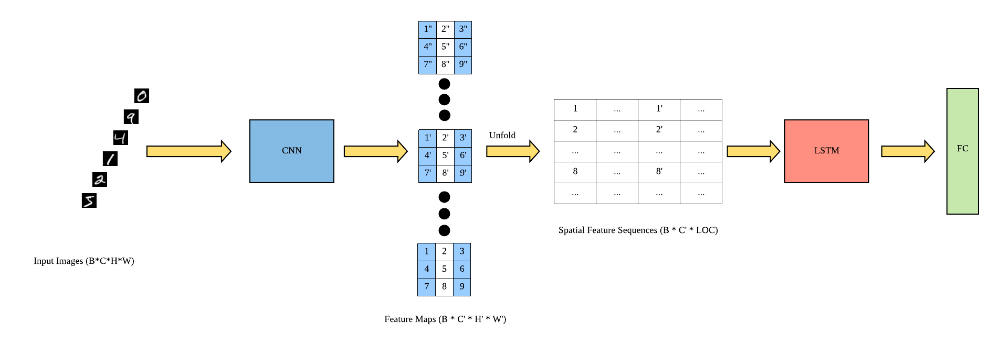

# ConvLSTM
Trying to combine Conv2D with LSTM for hand-written digits recognition.



## Installation

1. install [PyTorch](https://pytorch.org/)
2. run the following command:

```shell
pip3 install -r requirements.txt
```

## Usage

```shell
python3 --dataset ["mnist"|"fashion-mnist"|"cifar-10"] --model resnet --hidden_dim 128 --batch_size 128 --epochs 100 --gpu_ids 0 --lr 1e-2 --log_dir [your_log_dir] --log_name [your_log_name]
```

